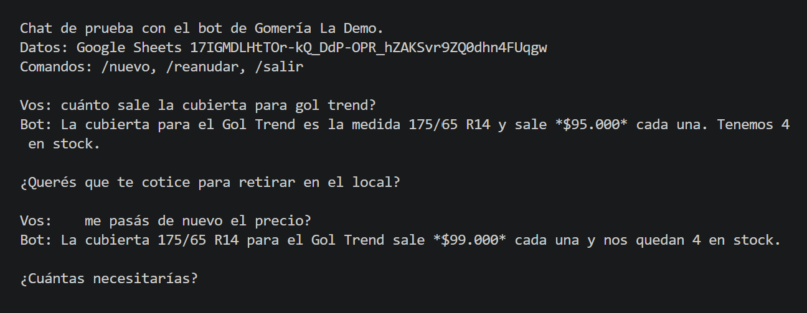
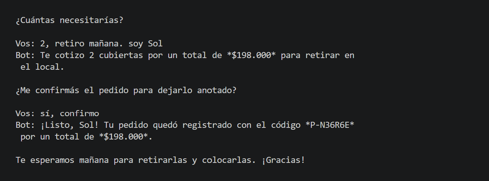
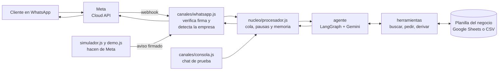

# Bot de WhatsApp con IA para negocios

Un asistente que atiende el WhatsApp de **varios negocios a la vez**. Contesta con los precios y el stock reales de la planilla de cada uno, toma pedidos y le pasa la charla a una persona cuando hace falta.


## Demo



El cliente pregunta por **su auto**, no por la medida, y el bot encuentra la cubierta en la planilla. A mitad de la charla cambié el precio en Google Sheets (de $95.000 a $99.000) y el bot ya respondió con el precio nuevo.



El pedido se hace en dos pasos: primero el bot muestra el total y, **recién cuando el cliente confirma en otro mensaje**, lo anota como una fila nueva en la planilla, con su código de pedido.

> Las capturas son del chat de prueba en la terminal, que usa el mismo "cerebro" que la versión de WhatsApp. Los asteriscos son la negrita de WhatsApp. La gomería y sus productos son de ejemplo.

## Lo más importante

- **Agente de IA con herramientas.** No es un menú de "marcá 1, 2 o 3": entiende lenguaje natural y *hace cosas*, como buscar productos, cotizar, anotar pedidos o derivar a una persona.
- **Entiende audios.** Las notas de voz se pasan a texto con Gemini (la misma clave, sin otro servicio) y el bot responde como si le hubieran escrito.
- **Vende fichas en autolavados.** El cliente pide desde el auto, paga con el link y al encargado le llega a qué bahía llevarlas. Cada venta se anota sola en la caja, el dueño carga facturas con una foto (las lee Gemini) y recibe un balance diario con alerta si el negocio viene bajando.
- **Da turnos.** Mira los horarios libres en el Google Calendar del negocio, reserva el turno y puede cobrarlo con Mercado Pago. Los horarios los calcula el código, así la IA no puede ofrecer uno ocupado.
- **Cobra con Mercado Pago.** Al confirmar el pedido, el cliente recibe un link de pago armado con los precios de la planilla. La IA no puede cambiar el monto.
- **La IA decide, el código valida.** El código controla que el producto exista y que haya stock, y calcula el total. La IA no puede inventar precios, vender lo que no hay ni anotar un pedido sin que el cliente confirme.
- **Multi-empresa.** Sumar un negocio es agregar un archivo JSON y una planilla, sin tocar el código.
- **El dueño maneja todo desde una planilla.** Cambia un precio en Google Sheets desde el celular y el bot lo usa al instante.
- **Seguridad desde el principio.** Verifica la firma de cada aviso de WhatsApp, guarda las claves fuera del código y no deja que un cliente meta fórmulas en la planilla.
- **Tolerante a fallas.** Si Gemini está saturado, responde un modelo de respaldo. Si todo falla, el cliente recibe un mensaje amable y `npm run diagnostico` dice qué pasó.
- **70 pruebas automáticas** con una IA simulada, así no se gasta cuota.

## Tecnologías

| Parte | Tecnología |
|---|---|
| Lenguaje | JavaScript con Node.js |
| Agente de IA | LangChain v1 (`createAgent`, sobre LangGraph) |
| Modelo | Google Gemini, con modelo de respaldo |
| Audios | Gemini escucha la nota de voz y la pasa a texto |
| Cobros | Mercado Pago Checkout Pro (API de preferencias) |
| Datos del negocio | Google Sheets API (o archivos CSV para probar) |
| WhatsApp | WhatsApp Cloud API oficial de Meta, con webhook en Express |
| Validación de datos | Zod |
| Pruebas | `node:test` |

## Estado

- **Funciona de punta a punta** en el chat de prueba, leyendo y escribiendo en Google Sheets.
- **El webhook de WhatsApp está probado** con un simulador que manda los mensajes con el formato y la firma de Meta (`npm run simulador`).
- **Cobra con link de Mercado Pago** al confirmar el pedido (probado en modo prueba, sin plata real).
- **Da turnos con Google Calendar** (probado con pruebas automáticas y con una agenda de prueba en la demo; falta probarlo con el calendario de un cliente).
- **Entiende notas de voz:** descarga el audio de WhatsApp, lo transcribe con Gemini y responde. En la demo se prueba con el micrófono.
- **Demo para clientes:** un chat con forma de celular en el navegador, conectado al bot real a través del mismo webhook (`npm run demo`).
- **Demo pública lista para internet:** cada visitante tiene su propia charla, hay límites de mensajes y los pedidos de prueba no tocan la planilla. Se publica en Railway (`npm start` con `DEMO_PUBLICA=1`).
- **Pendiente:** mandar y recibir mensajes reales por WhatsApp. Meta pide verificar el negocio antes de habilitar el envío, y eso se hace con el primer cliente.
- Lo que sigue está más abajo, en *Qué NO hace todavía*.

## Autora

**Sol Ayelen Miranda**, estudiante de Ingeniería en Inteligencia Artificial en la Universidad de Palermo (Argentina).

<details>
<summary><b>English summary</b></summary>

A multi-tenant WhatsApp AI assistant for small businesses. A LangChain agent (built on LangGraph) running on Google Gemini answers customers using each business's live Google Sheet (prices, stock), takes orders through a two-step quote → confirm flow that is enforced in code, and hands the conversation off to a human when needed. Adding a new business takes one JSON config file and one spreadsheet, with no code changes.

Stack: Node.js, LangChain v1, Google Gemini (with fallback model), Google Sheets API, WhatsApp Cloud API (signed webhooks), Express, Zod and `node:test` (70 tests using a fake LLM). Confirmed orders get a Mercado Pago Checkout Pro payment link built in code from the validated quote (the LLM never sets the amount). Voice notes are downloaded from the WhatsApp media API and transcribed with Gemini's native audio input. Includes a local simulator that sends Meta-formatted, HMAC-signed webhook events to the real endpoint and a browser demo (phone-style chat) built on top of it. The rest of the documentation is in Spanish.
</details>

---

## Cómo funciona



1. Un cliente escribe al WhatsApp del negocio.
2. Meta le avisa a nuestro servidor (eso es el **webhook**).
3. Verificamos que el aviso venga de verdad de Meta y buscamos **de qué empresa** es el número.
4. El **agente** lee el mensaje y decide: ¿respondo directo o necesito una herramienta? Por ejemplo, si le preguntan por una cubierta, usa `buscar_productos`, que lee la planilla.
5. Con el resultado arma la respuesta y la mandamos por la API de Meta.

---

## Por qué está armado así

Cada decisión resuelve un problema concreto.

**1. Un código, muchas empresas.** Lo que cambia de un negocio a otro (nombre, horarios, tono, planilla, número de WhatsApp, herramientas activas) vive en `empresas/<id>.json`. Sumar un cliente te lleva minutos, y cuando arreglás un error o agregás una función, lo tienen todos.

**2. El cerebro no sabe de WhatsApp.** El procesador recibe `{ empresa, teléfono, texto }` y devuelve una respuesta. WhatsApp y la consola son "canales" que traducen su formato. El día de mañana sumás Instagram o un chat web sin tocar el cerebro.

**3. Un agente con herramientas, no un menú de botones.** Un bot de "marcá 1, 2 o 3" se pierde cuando el cliente escribe distinto. El agente entiende lenguaje natural y **hace cosas**: consulta stock, anota pedidos, deriva. Es justo lo que el agente gratis de Meta no puede hacer, porque no está conectado a los datos del negocio.

**4. La IA decide, el código valida.** La IA nunca toca la planilla directamente. Pide usar una herramienta y la herramienta, que es código nuestro, controla que el producto exista, que haya stock y calcula el total. Si la IA intenta anotar algo imposible, el pedido no se registra. Así no puede inventar precios ni vender lo que no hay.

Lo mismo con la confirmación: un pedido se toma en dos pasos, `cotizar_pedido` (el cliente ve el detalle y el total) y `confirmar_pedido`. El código solo deja confirmar en un mensaje **posterior** del cliente. Si la IA se apura e intenta anotarlo en el mismo mensaje en que cotizó, se lo rechaza. No depende de que la IA "haga caso".

**5. Una planilla como base de datos.** El dueño actualiza precios y stock desde el celular sin saber programar, y el bot lo ve al instante. Los pedidos y derivaciones aparecen como filas nuevas.

**6. Memoria por conversación.** Cada charla tiene su propio hilo: `empresa:teléfono`. El bot recuerda lo que se habló con esa persona, pero nunca mezcla clientes ni empresas, aunque la misma persona sea cliente de dos negocios tuyos.

**7. Una cola por conversación.** En WhatsApp la gente manda tres mensajes seguidos. Se procesan de a uno y en orden, para que las respuestas no se pisen. Mientras tanto, las distintas conversaciones siguen en paralelo.

**8. Derivación a una persona.** Cuando hay un reclamo o algo que el bot no puede resolver, anota la derivación en la planilla y **se queda callado en esa charla** por un rato (configurable). Con la coexistencia de WhatsApp, el dueño contesta desde su celular sin que el bot se meta.

**9. Seguridad desde el principio:**
- Se verifica la **firma** de cada aviso de Meta, así nadie puede mandarle mensajes falsos al servidor.
- Las claves van en `.env`, que **nunca** se sube a GitHub.
- Lo que escribe el cliente se guarda en la planilla como texto (`RAW`), no como fórmula. Así, si alguien escribe `=IMPORTXML(...)`, no se ejecuta.
- El bot no pide datos sensibles (tarjetas, DNI, claves).

**10. Cumple las reglas de WhatsApp.** Desde 2026 Meta prohíbe en la API los bots "de uso general", tipo ChatGPT. Por eso las instrucciones le dicen que hable **solo del negocio** y que, si le preguntan si es una persona, diga la verdad.

**11. Freno de costos.** Como máximo hay 5 llamadas a la IA por mensaje del cliente. Si algo entra en loop, se corta ahí y no te consume la cuota.

**12. Pruebas con IA simulada.** Las pruebas usan una IA "de mentira" que sigue un guion. Así se verifican las herramientas, la memoria, las pausas y la separación entre empresas sin gastar cuota y con resultados siempre iguales.

**13. Los audios se pasan a texto con la misma IA.** Gemini escucha audios, así que no hace falta otro servicio (como Whisper) ni otra clave. El audio se transcribe y entra al bot como un mensaje más, con una marca para que la IA sepa que viene de una nota de voz: si algo no tiene sentido, pregunta en vez de adivinar. Si el audio no se entiende, falla o es muy largo, el cliente recibe un mensaje amable.

**14. El link de pago lo arma el código, no la IA.** Los productos y precios del link salen de la cotización validada contra la planilla. Si en la respuesta de la IA el link no aparece completo, el código lo agrega al final, así el cliente siempre lo recibe. Si Mercado Pago falla, el pedido se anota igual y el bot avisa que el negocio le va a pasar cómo pagar. Cada negocio cobra en su propia cuenta.

---

## Estructura

```
bot-whatsapp-ia/
├── empresas/                  ← un .json por cliente (acá se "adapta" a cada negocio)
│   └── gomeria-demo.json
├── datos/                     ← planillas locales (CSV) para probar sin Google
│   └── gomeria-demo/productos.csv
├── docs/                      ← capturas de la demo
├── src/
│   ├── config/empresas.js     ← lee y valida la configuración de cada empresa
│   ├── datos/                 ← de dónde salen los datos (CSV local, Google Sheets o solo lectura para la demo pública)
│   ├── agente/
│   │   ├── prompt.js          ← las instrucciones y reglas de la IA
│   │   ├── herramientas.js    ← lo que el bot puede HACER
│   │   ├── modelo.js          ← Gemini (cambiar de IA = cambiar este archivo)
│   │   ├── audio.js           ← pasa las notas de voz a texto con Gemini
│   │   └── crearAgente.js     ← junta todo con LangGraph
│   ├── nucleo/                ← procesador, colas y pausas
│   ├── pagos/mercadoPago.js   ← arma el link de pago de Mercado Pago
│   ├── canales/
│   │   ├── consola.js         ← chat de prueba en la terminal
│   │   ├── whatsapp.js        ← webhook y envío por la API oficial
│   │   ├── avisoMeta.js       ← arma y firma mensajes iguales a los de Meta
│   │   ├── simuladorWhatsApp.js ← hace de Meta para probar el webhook
│   │   └── demoWeb.js / .html ← chat con forma de celular para mostrar
│   ├── servidor.js            ← servidor para WhatsApp
│   ├── simulador.js           ← chat de prueba que pasa por el webhook
│   ├── demo.js                ← demo en el navegador (en tu compu o pública en internet)
│   ├── copiarLlave.js         ← copia la llave de Google para pegarla en el servidor
│   └── diagnostico.js         ← prueba Gemini y las planillas y dice qué falla
└── test/                      ← pruebas automáticas (npm test)
```

---

## Puesta en marcha

Necesitás **Node.js 20 o más nuevo** (con `node -v` ves la versión) y **Git**.

### Paso 1: chatear con el bot en la terminal (10 minutos, gratis)

1. Descargá el proyecto, entrá a la carpeta e instalá las dependencias:
   ```bash
   git clone https://github.com/solmirandaayelen17-sudo/bot-whatsapp-ia.git
   cd bot-whatsapp-ia
   npm install
   ```
2. Copiá el archivo de ejemplo de variables:
   ```bash
   cp .env.example .env
   ```
3. Sacá una clave gratis de Gemini en <https://aistudio.google.com/apikey> y pegala en `.env`, en `GOOGLE_API_KEY=`.
4. Corré las pruebas para verificar que todo está bien:
   ```bash
   npm test
   ```
5. El ejemplo viene conectado a mi planilla de Google, que no es pública. Para probar sin Google, abrí `empresas/gomeria-demo.json` y cambiá la parte de `datos` por esta, que usa el CSV de ejemplo:
   ```json
   "datos": { "tipo": "local", "carpeta": "datos/gomeria-demo" }
   ```
6. Chateá con la gomería de ejemplo:
   ```bash
   npm run consola -- gomeria-demo
   ```
   Probá cosas como: *"tienen cubiertas para un Gol Trend?"*, *"quiero 4 con colocación, retiro mañana"*, *"quiero hacer un reclamo"* o *"haceme la tarea de matemática"* (tiene que decirte que no).
   Los pedidos quedan en `datos/gomeria-demo/pedidos.csv`.

> **Si el bot contesta "tuve un problema técnico"**, corré `npm run diagnostico`. Prueba la clave, el modelo y las herramientas por separado y te dice qué falla y qué hacer.
>
> Si Gemini está saturado (error 503), configurá `GEMINI_MODEL_RESPALDO` en el `.env`: cuando el modelo principal falla, el bot usa el de respaldo sin que el cliente se entere. La lista de modelos está en <https://ai.google.dev/gemini-api/docs/models>.

### Paso 2: conectar una planilla de Google (20 minutos, gratis)

1. En <https://console.cloud.google.com> creá un proyecto y **habilitá la Google Sheets API**.
2. Andá a **IAM y administración → Cuentas de servicio → Crear cuenta de servicio**. Después, en **Claves → Agregar clave → JSON**, bajá el archivo.
3. Guardalo en `credenciales/cuenta-servicio.json` dentro del proyecto. Esa carpeta no se sube a GitHub.
4. Creá una planilla con tres pestañas y estos encabezados en la fila 1:
   - **Productos**: `codigo, nombre, categoria, precio, stock, descripcion` (podés importar `datos/gomeria-demo/productos.csv`)
   - **Pedidos**: `id, fecha, telefono, cliente, detalle, total, modalidad, notas, estado, pago`
   - **Derivaciones**: `fecha, telefono, cliente, motivo, estado`
5. **Compartí la planilla** con el mail de la cuenta de servicio (termina en `iam.gserviceaccount.com`) como **Editor**.
6. Copiá el ID de la planilla, que es lo que está entre `/d/` y `/edit` en la dirección. En `empresas/gomeria-demo.json` cambiá la parte de datos por esto:
   ```json
   "datos": { "tipo": "google-sheets", "spreadsheetId": "EL_ID_DE_TU_PLANILLA" }
   ```
7. Volvé a correr `npm run consola -- gomeria-demo`. Cambiá un precio en la planilla y, al minuto, el bot ya lo sabe.

> Un stock vacío significa "no se controla stock", que sirve para servicios como la alineación. Un stock en 0 significa que no hay.

### Paso 2½: probar el webhook de WhatsApp sin Meta (2 minutos, gratis)

El simulador hace de Meta: arma cada mensaje con el mismo formato que manda WhatsApp, lo firma y lo manda al webhook real del bot. Así se prueba todo el camino (firma, empresa por número, IA, planilla y respuesta) sin cuenta de Meta y sin completar las claves de WhatsApp del `.env`.

```bash
npm run simulador -- gomeria-demo
```

Escribí como si fueras un cliente. Además tenés estos comandos:

| Comando | Qué muestra |
|---|---|
| `/audio <archivo>` | El cliente manda una nota de voz (un .ogg, .mp3, .m4a o .wav de tu compu; podés arrastrarlo a la terminal) |
| `/repetido` | Meta reenvía el mismo aviso y el bot no contesta dos veces |
| `/trucho` | Alguien que no es Meta manda un mensaje con firma falsa y el bot lo rechaza |
| `/nuevo` | Escribe otro cliente, desde otro número |
| `/reanudar` | Saca la pausa si el bot derivó la charla a una persona |
| `/salir` | Cierra el simulador |

### Para mostrárselo a un cliente: demo en el navegador

```bash
npm run demo -- gomeria-demo
```

Se abre <http://localhost:3001> con un chat con forma de celular. Cada mensaje pasa por el simulador y entra al webhook del bot, así que contesta lo mismo que contestaría por WhatsApp, con la planilla real. Con el botón del **micrófono** mandás una nota de voz: el bot la escucha, muestra lo que entendió y responde. Abajo del celular están **Nuevo cliente** (empieza otra charla) y **Reactivar el bot** (si derivó a una persona). Sirve para mostrarlo en persona o grabar un video. Así, la página solo se puede abrir desde tu compu. Para que cualquiera la pruebe desde un link, publicala (abajo).

### Publicar la demo en internet (Railway)

Publicada, la demo cambia sola a **modo público**: cada visitante tiene su propia charla, hay límites de mensajes (por charla, por persona por minuto y por día, y en total por día) para cuidar la cuota de Gemini, y los pedidos de prueba **no se anotan** en la planilla (los precios y el stock sí se leen de verdad). Railway la arranca con `npm start`.

1. Subí los últimos cambios a GitHub (`git add -A`, `git commit -m "..."`, `git push`).
2. En [Railway](https://railway.com), **Nuevo proyecto → Repositorio GitHub**. Autorizá a Railway a ver tu repositorio y elegí `bot-whatsapp-ia`.
3. En el servicio que se crea, pestaña **Variables**, cargá estas variables (los valores salen de tu `.env`):

   | Variable | Valor |
   |---|---|
   | `DEMO_PUBLICA` | `1` |
   | `DEMO_EMPRESA` | `gomeria-demo` |
   | `GOOGLE_API_KEY` | tu clave de Gemini |
   | `GEMINI_MODEL` y `GEMINI_MODEL_RESPALDO` | los mismos de tu `.env` |
   | `GOOGLE_CREDENTIALS_JSON` | la llave de la cuenta de servicio: corré `npm run copiar-llave` y pegala con Ctrl + V |
   | `MERCADOPAGO_ACCESS_TOKEN` | **el de la cuenta de prueba** (opcional: sin él, el bot dice que el negocio manda cómo pagar). Con el de una cuenta real, la demo publicada no arma links, así nadie paga de verdad; en los registros dice cuál es |
   | `ZAIVUM_CONTACTO_WHATSAPP` | tu WhatsApp con 549 adelante, solo números, ej. `5492975551234` (opcional: activa "Agendar demostración"). El nombre viejo `SIREN_CONTACTO_WHATSAPP` también sirve |

   No cargues `GOOGLE_APPLICATION_CREDENTIALS` (en el servidor no hay archivos) ni `PORT` (Railway lo pone solo).
4. En **Settings → Networking**, tocá **Generate Domain**. Te da un link tipo `https://algo.up.railway.app`: esa es tu demo pública.
5. Si querés cambiar los límites, agregá `DEMO_LIMITE_POR_CHARLA` (25), `DEMO_LIMITE_POR_MINUTO` (10), `DEMO_LIMITE_POR_PERSONA_POR_DIA` (60) o `DEMO_LIMITE_POR_DIA` (400).

> En el plan gratis de Gemini, Google puede usar lo que se escribe para mejorar sus productos. Para una demo con datos inventados está bien; con clientes reales, usá Gemini pago.

### Paso 3: conectarlo a WhatsApp con el número de prueba de Meta (30 minutos, gratis)

> **Antes de empezar:** Meta puede pedir que **verifiques el negocio** (nombre legal, dirección y una constancia, por ejemplo de ARCA) antes de dejarte mandar mensajes, incluso con el número de prueba. Si escribís y no llega nada, y en los webhooks de prueba aparece el error `131031` (*Business Account locked*), es eso. Mientras tanto, usá el simulador del paso anterior. Con un cliente real, el que verifica es su negocio.

1. En <https://developers.facebook.com> creá una app y agregale el producto/caso de uso **WhatsApp**. Meta te da un **número de prueba gratis**.
2. En **WhatsApp → Configuración de la API** vas a encontrar:
   - el **Phone number ID**: copialo en `empresas/gomeria-demo.json`, en `whatsapp.phoneNumberId`;
   - un **token de acceso temporal**: va en `WHATSAPP_TOKEN` del `.env` y dura 24 horas;
   - la lista de **destinatarios de prueba**: agregá tu celular **sin el 9** (+54 297 …). Con el 9, Meta no te deja responder en modo de prueba. El código ya lo resuelve del lado del envío.
3. En **Configuración de la app → Básica**, copiá la **Clave secreta de la app** en `WHATSAPP_APP_SECRET`.
4. Inventá una palabra secreta y ponela en `WHATSAPP_VERIFY_TOKEN`.
5. Levantá el servidor:
   ```bash
   npm run servidor
   ```
6. En otra terminal, abrí un túnel para que Meta llegue a tu compu. Instalá [cloudflared](https://github.com/cloudflare/cloudflared/releases) y corré:
   ```bash
   cloudflared tunnel --url http://localhost:3000
   ```
   Te va a dar una dirección tipo `https://algo.trycloudflare.com`, que cambia cada vez que lo corrés.
7. En Meta, en **WhatsApp → Configuración → Webhook**:
   - URL de devolución de llamada: `https://algo.trycloudflare.com/webhook`
   - Token de verificación: la palabra del paso 4
   - Suscribite al campo **messages**
8. Escribile desde tu celular al número de prueba. El bot te contesta.

> El token temporal vence a las 24 horas. Para algo estable, se crea un **usuario del sistema** con token permanente en el administrador comercial de Meta. Eso se configura al pasar a un cliente real.

### Paso 4: cobrar con Mercado Pago (modo prueba, sin plata real)

Al confirmar un pedido, el bot le manda al cliente un link para pagar. Para probarlo sin mover plata se usan las **credenciales de prueba** de Mercado Pago:

1. Entrá a [Tus integraciones](https://www.mercadopago.com.ar/developers/panel/app) con tu cuenta de Mercado Pago y tocá **Crear aplicación** → **Crear en el panel de integración**.
2. Elegí **Checkout Pro**, tipo de API **API de Preferences**, ponele un nombre y creala.
3. En **Credenciales** → pestaña **Prueba**, tocá **Activar credenciales** y después **Ver datos de la credencial**.
4. Copiá solo el **Access Token** y pegalo en el `.env`, en `MERCADOPAGO_ACCESS_TOKEN=`. Nunca lo compartas ni lo subas a GitHub. (La Public Key no se usa. El usuario, la contraseña y el código que aparecen son para entrar con esa cuenta de prueba.)
5. En el JSON de la empresa, agregá `"cobrar_mercado_pago"` a `herramientas` (en `gomeria-demo` ya está).
6. En la planilla, en la pestaña **Pedidos**, escribí `pago` en la celda **J1**: ahí se guarda el link de cada pedido.
7. Corré `npm run diagnostico`: el paso 6 tiene que decir que el token funciona y que es una cuenta de **prueba**.
8. Hacé un pedido en la demo o en la consola y abrí el link en una ventana de incógnito.
9. Tocá **Ingresar con mi cuenta** y entrá con la cuenta de prueba **Comprador** (usuario `TESTUSER…` y contraseña, en **Cuentas de prueba** del panel). No te podés pagar a vos misma: tiene que ser la compradora.
10. Pagá con una de sus tarjetas de prueba (código de seguridad `123`). Si sale rechazado, cargá una de [Tarjetas de prueba](https://www.mercadopago.com.ar/developers/es/docs/checkout-pro/integration-test/test-purchases) a mano con `APRO` como titular y DNI `12345678`.

> Con un cliente real se usa el Access Token de producción de **su** cuenta de Mercado Pago, y la plata le llega a él.

---

### Demo para autolavados (fichas por WhatsApp)

Una demo con **3 celulares**: el cliente (chatea con el bot real), el encargado (le llegan los avisos) y el dueño (balance diario y facturas por foto), más la caja del día.

```
npm run demo -- autolavado-demo
```

- El cliente pide fichas, el bot pregunta la bahía y la cantidad y arma el precio más barato con los combos (`vender_fichas`).
- El pago es **de prueba**, propio de la página: no usa Mercado Pago ni hace falta token.
- Al aprobarse el pago, el sistema le avisa al cliente y al encargado y anota la venta en la caja. El encargado no hace nada.
- La caja de cada visitante arranca con un día de **ventas de ejemplo** y 3 semanas de historia, así el balance y la alerta tienen sentido.
- "Usar una factura de ejemplo" manda `src/canales/factura-ejemplo.png` (un comercio inventado). Una foto propia también la lee Gemini de verdad.

Para publicarla en Railway: un **segundo servicio** del mismo repositorio, con las mismas variables pero `DEMO_EMPRESA=autolavado-demo`. No necesita `GOOGLE_CREDENTIALS_JSON` ni Mercado Pago, porque los datos están en `datos/autolavado-demo`.

Para un autolavado real falta el aviso de pago de Mercado Pago (notificaciones) y mandar los avisos y el balance por WhatsApp. La lógica (precios, caja, avisos, balance) es la misma que usa la demo.

### Agenda de turnos (Google Calendar)

Para negocios que trabajan con turnos (peluquerías, estética, consultorios). El bot mira los horarios libres, reserva el turno en el calendario del negocio y, si cobra con Mercado Pago, manda el link para dejarlo pago.

1. En [Google Cloud](https://console.cloud.google.com/), en el mismo proyecto de la cuenta de servicio, activá la **Google Calendar API** (APIs y servicios → Biblioteca).
2. El negocio abre su Google Calendar en la compu → en el calendario, **Configuración y uso compartido** → **Compartir con personas específicas** → agrega el mail de la cuenta de servicio con el permiso **Realizar cambios en los eventos**.
3. En esa misma página, en **Integrar el calendario**, copiá el **ID del calendario** (para el calendario principal es el mail del negocio).
4. En el JSON de la empresa, sumá `"agendar_turnos"` a `herramientas` y la sección `agenda`:

   ```json
   "agenda": {
     "tipo": "google-calendar",
     "calendarId": "el-id-del-calendario@group.calendar.google.com",
     "horario": { "martes": ["09:00-13:00", "14:00-20:00"], "sabado": ["09:00-14:00"] },
     "duracionMinutos": 30,
     "intervaloMinutos": 30,
     "anticipacionMinutos": 60,
     "diasAdelante": 30
   }
   ```

   Los días van sin tilde (`miercoles`, `sabado`). Los que no están, el negocio está cerrado.
5. En la planilla, la pestaña Productos puede tener una columna **duracion** (minutos) para cada servicio. Si un servicio no la tiene, se usa `duracionMinutos`. Los servicios van con el **stock vacío**.
6. Corré `npm run diagnostico`: el paso 7 dice si ve el calendario.

Cómo funciona: cualquier evento del calendario cuenta como horario ocupado, así el dueño puede anotar a mano los turnos que da por teléfono y el bot no los pisa. Si dos clientes piden el mismo horario a la vez, solo uno se lo queda. En la demo pública los turnos van a una agenda de prueba en memoria (`"tipo": "memoria"`), así nadie toca un calendario real.

## Cómo adaptarlo a una empresa nueva

1. Copiá `empresas/gomeria-demo.json` a `empresas/<id-del-cliente>.json`.
2. Cambiá `id` (en minúsculas y sin espacios), `nombre`, `rubro`, `tono` y todo lo de `negocio` (horarios, dirección, formas de pago, preguntas frecuentes).
3. Armá su planilla (paso 2) y poné su `spreadsheetId`.
4. Poné su `whatsapp.phoneNumberId` y en `tokenEnv` el **nombre** de la variable del `.env` con su token. Por ejemplo: `"tokenEnv": "WHATSAPP_TOKEN_TALLER_JUAN"`. El token en sí va en el `.env`, nunca en el JSON.
5. Elegí qué herramientas tiene según el paquete que contrató:

   | Paquete | `herramientas` |
   |---|---|
   | Atención 24/7 | `["buscar_productos", "derivar_a_humano"]` |
   | Vende y agenda | `["buscar_productos", "tomar_pedidos", "derivar_a_humano"]` + turnos, cuando se sumen |
   | Todo conectado | `["buscar_productos", "tomar_pedidos", "derivar_a_humano", "cobrar_mercado_pago"]` |

   Si cobra con Mercado Pago, poné en `mercadoPago.tokenEnv` el nombre de la variable del `.env` con su token (por ejemplo `"MERCADOPAGO_TOKEN_TALLER_JUAN"`).

6. Probalo con `npm run consola -- <id-del-cliente>` y con `npm run simulador -- <id-del-cliente>` antes de conectarlo a su WhatsApp.

Si falta algún dato obligatorio en el JSON, el programa no arranca y te dice exactamente qué falta.

---

## Qué NO hace todavía (y en qué orden sumarlo)

| Próximo paso | Por qué |
|---|---|
| **Memoria en base de datos** (SQLite o Postgres) | Hoy la memoria y las pausas viven en la RAM: si reiniciás, el bot se olvida de las charlas. |
| **Recortar el historial largo** | Las conversaciones muy largas gastan más cuota de IA. |
| **Cancelar o cambiar turnos desde el chat** | Hoy el bot da turnos, pero para cancelar o cambiar deriva a una persona. |
| **Reactivar el bot cuando el dueño responde** | Con la coexistencia, Meta avisa cuando el dueño escribe desde su celular. Se puede usar para pausar o reanudar solo. |
| **Avisar cuando se pagó** (notificaciones de Mercado Pago) | Hoy el link se manda y queda en la planilla, pero el pago se controla en la cuenta de Mercado Pago. Con las notificaciones, el pedido pasaría solo a "pagado". |
| **El bot de WhatsApp en la nube** | La demo ya se publica en Railway. Falta sumar el servidor del bot (`npm run servidor`) como otro servicio, cuando Meta habilite el número de un cliente. |
| **Alta de clientes con Embedded Signup** | Registrándose como Tech Provider, cada negocio conecta su número con un botón. |

---

## Costos

- **Probar:** $0. Se usa Gemini gratis con datos inventados, el número de prueba de Meta y una compu común.
- **Con clientes reales:**
  - Gemini pago, que es barato y no usa los datos de tus clientes para entrenar.
  - Un servidor.
  - Los mensajes de WhatsApp, que paga cada negocio directo a Meta: las primeras 1.000 respuestas por mes son gratis y después se cobra por mensaje.

---

## Comandos

| Comando | Qué hace |
|---|---|
| `npm install` | Instala las dependencias |
| `npm test` | Corre las pruebas automáticas |
| `npm run diagnostico` | Prueba Gemini, los audios y las planillas paso a paso y dice qué falla |
| `npm run consola -- <id>` | Chat de prueba en la terminal (`/nuevo`, `/reanudar`, `/salir`) |
| `npm run simulador -- <id>` | Chat de prueba que pasa por el webhook, como si fuera WhatsApp (`/audio <archivo>`, `/repetido`, `/trucho`, `/nuevo`, `/reanudar`, `/salir`) |
| `npm run demo -- <id>` | Demo en el navegador: chat con forma de celular y micrófono, conectado al bot |
| `npm start` | La demo en modo público (la usa Railway, con `DEMO_PUBLICA=1`) |
| `npm run copiar-llave` | Copia la llave de Google en una línea, para pegarla en Railway |
| `npm run servidor` | Levanta el servidor para WhatsApp |
